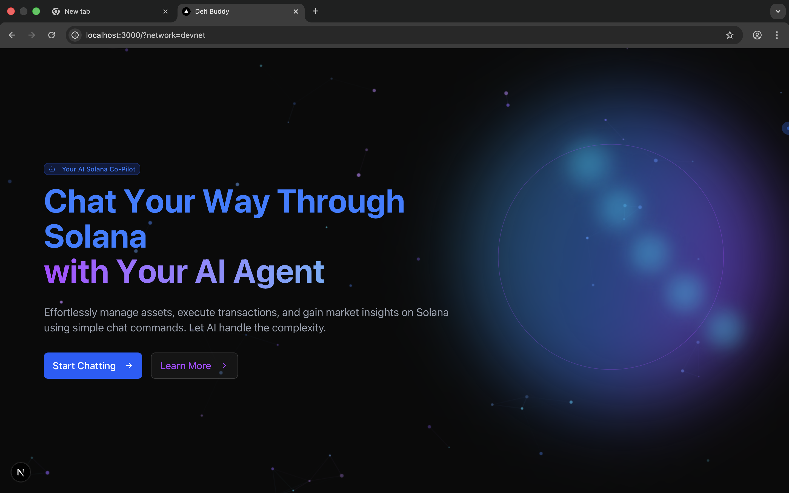
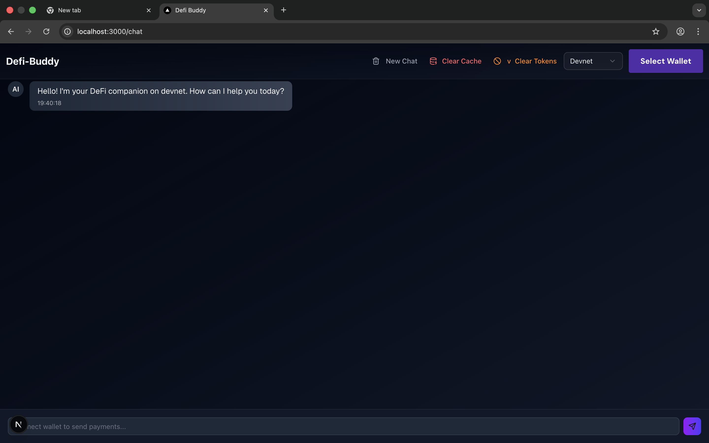
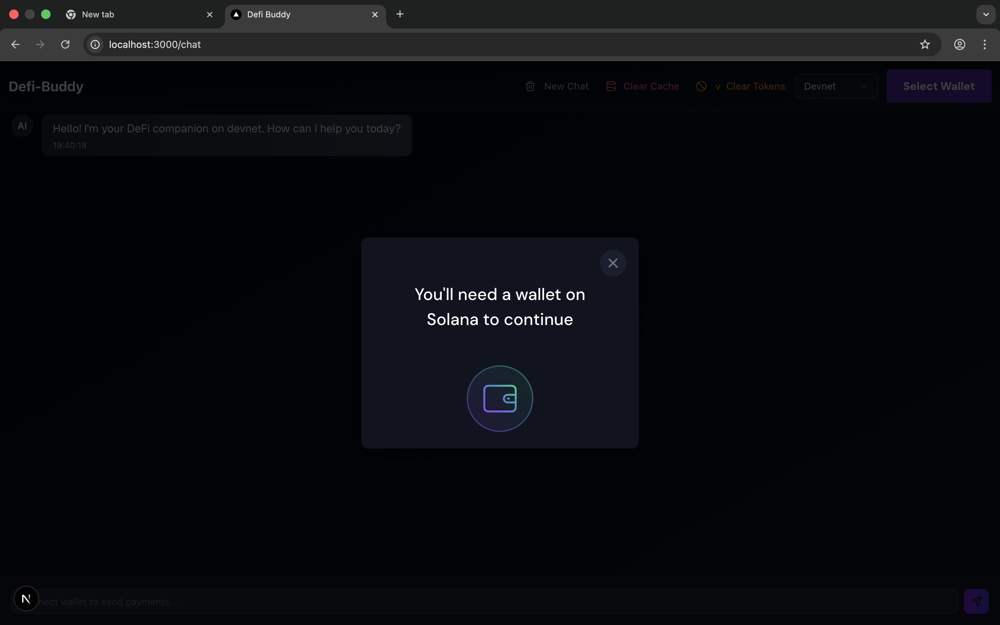

# Defi Buddy: Your Solana AI Sidekick
https://dummiies-defi.vercel.app/?network=devnet

Hey there! Welcome to **Defi Buddy**. We built this to bridge the gap between complex DeFi protocols and a simple, conversational interface. No more wrestling with complicated dashboards just to swap tokens or check your liquidity.

## What is this project?

Defi Buddy is an AI-powered assistant for the Solana blockchain. It combines a custom-built Solana program (using the Anchor framework) with a sleek Next.js frontend and an AI chat interface. 

The idea is simple: You talk to the bot, and the bot handles the heavy lifting on-chain. Whether you're swapping tokens or adding liquidity to a pool, it should feel like you're just having a chat with a friend who knows Solana inside out.

---

## The Good Stuff (Features)

*   **AI-Powered Chat**: Forget clicking fifty buttons. Just tell the buddy what you want to do.
*   **Custom AMM**: Our own Anchor program that handles constant-product swaps and liquidity management.
*   **Built for Speed**: Running on Solana means everything is fast and cheap.
*   **Modern UI**: A dark, premium aesthetic that stays out of your way and lets you focus on your assets.

---

## A Look Around

### The Homepage

*Description: This is the first thing you'll see. It’s designed to be clean and welcoming, with a quick path to get you started chatting.*

### The Chat Interface

*Description: This is the command center. You can see the conversation history and the input where you can give commands to your AI sidekick.*

### Wallet Connection

*Description: To interact with the Solana blockchain, you'll need to connect your wallet. The app makes this easy with a clear prompt if you're not already connected.*

---

## Technical Bits

### The Program (Smart Contract)
Hidden in the `programs/` folder is a Rust-based Anchor program. It supports:
- Initializing token pools.
- Swapping tokens (Token A for Token B and vice versa).
- Proportional liquidity provision.

### The Frontend
The `app/` directory houses a Next.js 15 application. It uses:
- **Tailwind CSS** for styling.
- **Framer Motion** for those smooth transitions.
- **Solana Wallet Adapter** for secure on-chain interactions.

---

## Setting Up Locally

If you want to poke around the code:

1.  **Program**: `anchor build` and `anchor test`.
2.  **Frontend**: 
    ```bash
    cd app/web3-for-dummies-ui
    npm install
    npm run dev
    ```

Go ahead, take it for a spin!
